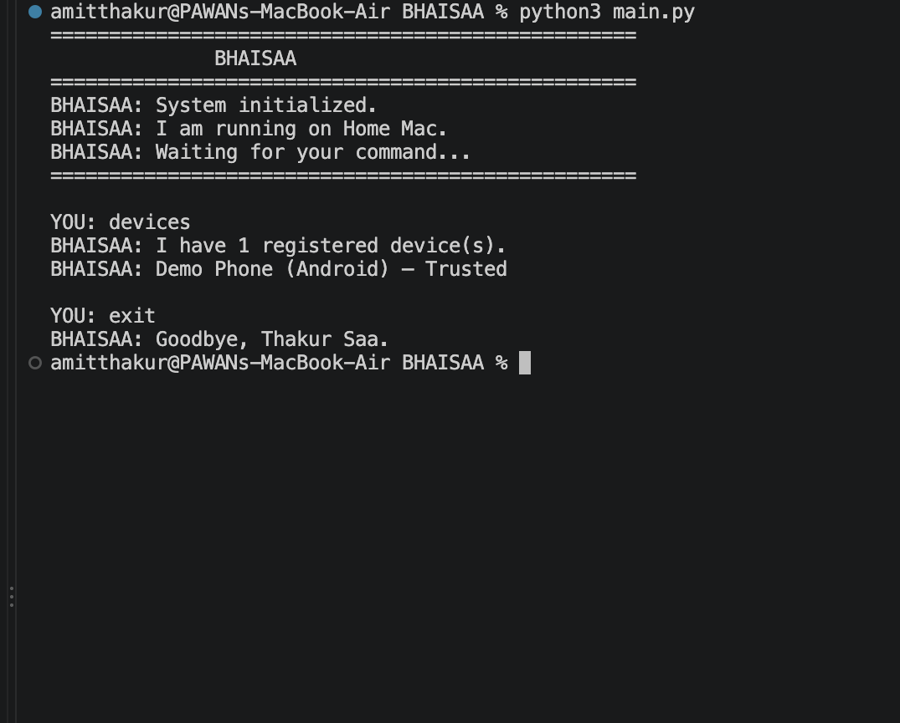

# BHAISAA

BHAISAA is a personal AI assistant project currently under development.

## Current capabilities

- Configurable assistant identity and device information
- Command-based interaction
- Device registration
- Device search and listing
- 6-digit pairing-code prototype
- Device trust workflow after successful pairing
- Initial connection-strategy abstraction for trusted devices

## Project status

This is an early-stage personal project. The AI model is not connected yet, and the network-independent device connection architecture is still being explored.

## Files

- `main.py` — command engine and application loop
- `device_manager.py` — device registry, search, registration, pairing-code and trust logic
- `connection_manager.py` — connection-strategy abstraction
- `config.example.json` — example local configuration
- `devices.example.json` — example empty device registry

## Local setup

1. Copy `config.example.json` to `config.json`.
2. Copy `devices.example.json` to `devices.json`.
3. Edit the local configuration values.
4. Run:

```bash
python3 main.py
```

The local `config.json` and `devices.json` files are intentionally excluded from Git because they contain machine/device-specific information.

## Status

BHAISAA is actively being developed. Future work includes a network-independent device-pairing architecture and broader assistant capabilities.

## Demo

The current prototype demonstrates:

- Device registration
- Untrusted device status before pairing
- 6-digit pairing-code generation
- Pairing-code verification
- Device trust management

### Pairing Demo



The demo shows a device being registered, paired through a 6-digit code, and successfully marked as trusted.
